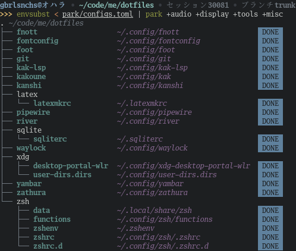

## park
A configuration-based dotfiles manager able to organize dotfiles by symlinking them according
to a configuration file written in TOML.

### Usage
See `park(1)` and `park(5)`.

### Contributing
[Use the mailing list](mailto:~gbrlsnchs/park-dev@lists.sr.ht) to
- Report issues
- Request new features
- Send patches
- Discuss development in general

If applicable, a new ticket will be submitted by maintainers to [the issue
tracker](https://todo.sr.ht/~gbrlsnchs/park) in order to track confirmed bugs or new features.

### Building and distributing the project
This project is built entirely in Rust. Build it as you wish for local usage, and package it
to your distro of preference in accordance with its policy on how to package Rust projects.

> **_NOTE_:** `cargo build` generates shell completions for Bash, ZSH and Fish, which
> are available at `target/completions`, and manpages at `target/doc` (only when
> [`scdoc`](https://git.sr.ht/~sircmpwn/scdoc) is available).
